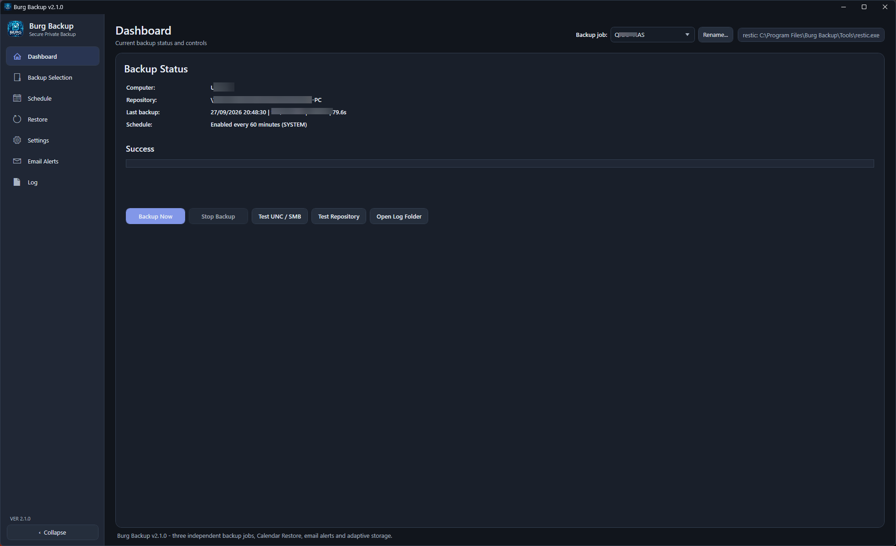
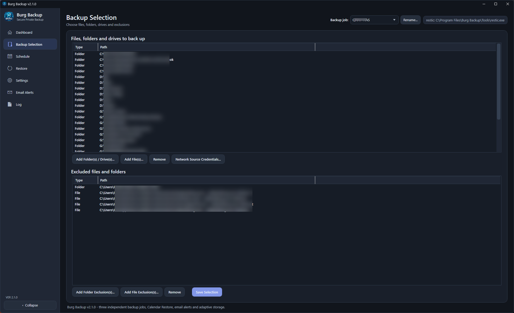
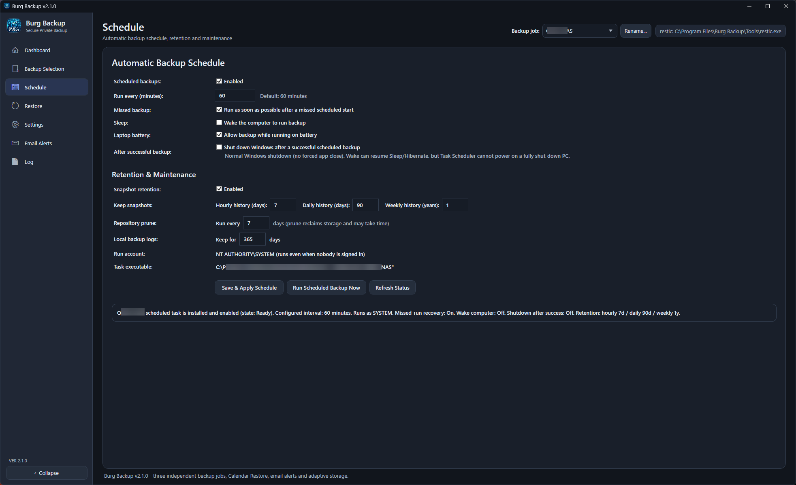
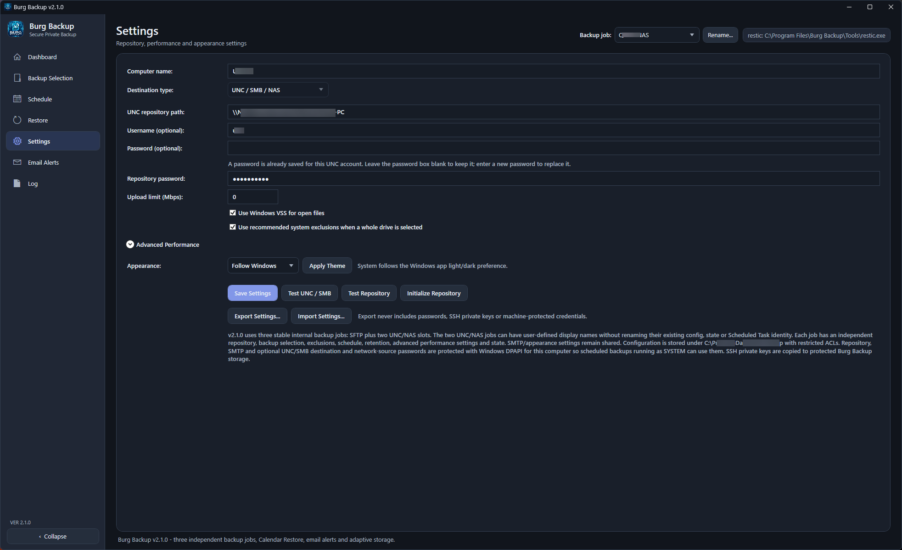
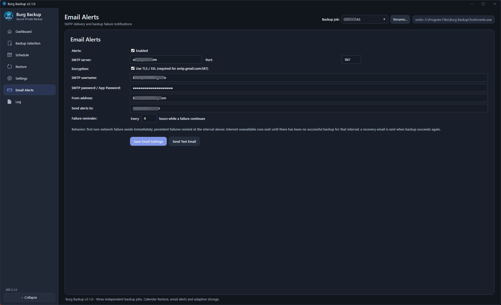

# Burg Backup

**מעטפת גיבוי ושחזור ל-Windows המבוססת על restic**

> **Freeware · קוד סגור · Windows 11 x64**

Burg Backup היא תוכנת Windows שמספקת ממשק גרפי למנוע הגיבוי restic. המטרה היא לאפשר גיבויים מוצפנים, שמירת גרסאות, תזמון, גיבוי ל-SFTP או NAS/SMB ושחזור נוח בלי לבנות ידנית פקודות restic.

[English](README.md) · [מדריך משתמש בעברית](docs/BurgBackup-2.1.0-Manual-HE.html) · [מדיניות תמיכה](SUPPORT.md) · [אבטחה](SECURITY.md) · [פרטיות](PRIVACY.md)

## הורדה

את קובץ ההתקנה מורידים מאזור **Releases** של המאגר. בכל גרסה מומלץ להשוות את קובץ ה-MSI ל-SHA-256 שיפורסם יחד איתו.

**גרסה נוכחית: 2.1.6**

> GitHub מוסיף אוטומטית לכל Release קישורים בשם “Source code (zip)” ו-“Source code (tar.gz)”. קבצים אלה מכילים רק את הקבצים הציבוריים שבמאגר התיעוד וההפצה הזה. **קוד המקור של Burg Backup אינו נכלל בהם.**

## צילומי מסך

מספר דוגמאות מממשק Burg Backup. ניתן ללחוץ על כל צילום כדי לצפות בו בגודל מלא.

### לוח הבקרה

| הגדרת גיבוי | תזמון |
| --- | --- |
|  |  |
| הגדרות התוכנה | התראות ועדכונים |
| --- | --- |
|  |  |

## תכונות עיקריות

- שלושה גיבויים עצמאיים: SFTP ושני יעדי UNC/SMB/NAS עם שמות תצוגה לבחירת המשתמש.
- מאגרי restic מוצפנים, Snapshots ושמירת גרסאות עם Deduplication.
- בחירת קבצים, תיקיות וכוננים שלמים, כולל בחירה מרובה והחרגות.
- מקורות גיבוי ברשת עם credentials ייעודיים ובדיקת הרשאות רקורסיבית.
- גיבוי מתוזמן באמצעות Windows Task Scheduler תחת SYSTEM.
- תור גיבויים שמונע הרצת כמה Jobs של restic במקביל.
- VSS למקורות מקומיים מתאימים.
- Retention וניהול מקום Adaptive Storage.
- שחזור לפי Repository, תאריך, Snapshot, תיקייה וקובץ.
- בחירה תלת-מצבית היררכית בעץ השחזור במצב בהיר וכהה.
- שחזור תקין מ-Snapshots הכוללים מקורות UNC, לרבות Snapshot משולב של דיסק מקומי ומקור רשת.
- התראות בדוא"ל באמצעות SMTP, Google OAuth 2.0 או Microsoft OAuth 2.0.
- בדיקת עדכונים ידנית ובדיקה אוטומטית אופציונלית מול GitHub; התוכנה מודיעה בלבד ואינה מתקינה עדכון אוטומטית.
- חיווי חי ולוגים מקומיים.
- יעדי SFTP ו-UNC/SMB/NAS.
- ייבוא וייצוא של הגדרות שאינן סודיות.
- Follow Windows, Light ו-Dark.

## מה חדש ב-2.1.6

גרסה 2.1.6 מוסיפה **בדיקת עדכונים מול ה-Releases הרשמיים ב-GitHub**, ידנית ואוטומטית. הבדיקה האוטומטית פועלת רק בממשק הגרפי, לכל היותר פעם ב-24 שעות, ניתנת לביטול ב-Settings, ולעולם אינה מורידה או מתקינה עדכון בעצמה.

השינויים מאז הגרסה הציבורית 2.1.0 כוללים גם:

- הגדרות דוא"ל כלליות יותר ומצבי אימות SMTP נוספים.
- Google OAuth 2.0 ל-Gmail / Google Workspace באמצעות Gmail API.
- Microsoft OAuth 2.0 ל-Microsoft 365 / Outlook.com באמצעות Microsoft Graph `Mail.Send`.
- הסתרת שדות SMTP שאינם רלוונטיים כאשר נבחר OAuth.
- תיקון שחזור של Snapshots הכוללים שורשי UNC כגון `\\server\share`, כולל Snapshot משולב של מקורות מקומיים ורשתיים.
- מנגנון הגישה הרקורסיבית למקורות רשת ובחירת credentials שנוסף ב-2.1.0 נשמר ללא שינוי.

פירוט מלא מופיע ב-[CHANGELOG.md](CHANGELOG.md).

## אזהרה חשובה לגבי גיבוי

אין להסתפק בכך שגיבוי הסתיים בהצלחה. לאחר ההגדרה הראשונית ומדי פעם בהמשך יש לבצע **שחזור אמיתי**, לפתוח את הקבצים ששוחזרו ולוודא שהם תקינים.

Burg Backup מסופקת **AS IS**, ללא SLA וללא התחייבות לתמיכה. ראו [LICENSE.txt](LICENSE.txt) ו-[SUPPORT.md](SUPPORT.md).

## פרטיות

Burg Backup 2.1.6 אינה כוללת שירות Telemetry או Analytics שמופעל על-ידי מפתח התוכנה. בדיקת העדכונים האופציונלית שולחת בקשת HTTPS רגילה ולא מאומתת ל-GitHub Releases API; היא אינה שולחת תוכן גיבוי, פרטי חשבון Burg Backup או מזהה ייחודי של המחשב. ראו [PRIVACY.md](PRIVACY.md).

## רישיון

Burg Backup היא **Freeware בקוד סגור ואינה Open Source**. השימוש מותר ללא תשלום בכפוף לרישיון. רכיבי צד שלישי נשארים תחת הרישיונות שלהם; restic מופץ תחת BSD 2-Clause. ראו [THIRD-PARTY-NOTICES.md](THIRD-PARTY-NOTICES.md).

## קשר לפרויקט restic

Burg Backup היא פרויקט עצמאי ואינה קשורה, ממומנת או מאושרת על ידי פרויקט restic.
