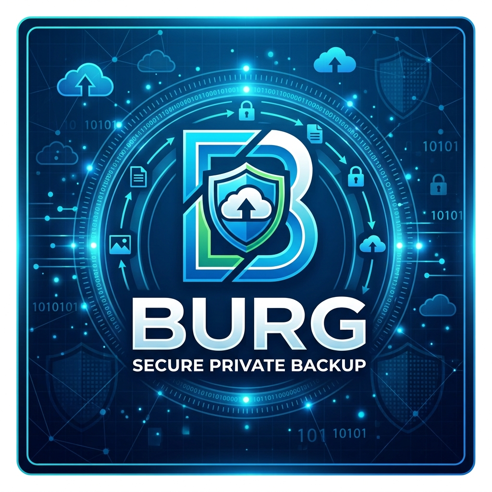

# Burg Backup

**Free Windows backup and restore frontend powered by restic**

> **Freeware · Closed source · Windows 11 x64**

Burg Backup is a Windows desktop application that provides a graphical interface around the restic backup engine. It is intended for users who want encrypted, versioned backups with Windows-oriented scheduling, logging, restore, NAS/SMB and SFTP support without having to build restic command lines manually.

[עברית](README-HE.md) · [Hebrew user manual](/007me/BurgBackup/releases/download/v2.1.0/BurgBackup-2.1.0-Manual-HE.html) · [English user manual](/007me/BurgBackup/releases/download/v2.1.0/BurgBackup-2.1.0-Manual-EN.html) · [Support policy](SUPPORT.md) · [Security](SECURITY.md) · [Privacy](PRIVACY.md)
## Download

Download the installer from the **Releases** section of this repository. For each release, verify the published SHA-256 checksum before installing.

**Current release:** 2.1.0

> GitHub automatically displays “Source code (zip)” and “Source code (tar.gz)” for every release. Those archives contain only the public files in this documentation/distribution repository. **The Burg Backup application source code is not included.**

## Main features

- Three independent backup jobs: SFTP plus two UNC/SMB/NAS jobs with user-defined display names.
- Encrypted restic repositories with versioned snapshots and deduplication.
- File, folder and full-drive source selection, including multiple selections and exclusions.
- Network backup sources with source-specific SMB credentials and recursive access testing.
- Scheduled backups through Windows Task Scheduler, running as SYSTEM.
- Backup queueing so multiple jobs do not run restic concurrently.
- VSS support for suitable local sources.
- Retention policy and Adaptive Storage management.
- Restore browser by repository, date, snapshot, folder and file.
- Hierarchical three-state restore selection in Light and Dark modes.
- Live backup and restore status, local logs and optional SMTP alerts.
- SFTP and UNC/SMB/NAS destinations.
- Import/export of non-secret settings.
- Light, Dark and Follow Windows appearance modes.

## What's new in 2.1.0

Version 2.1.0 improves backup of **UNC/SMB network sources**:

- Burg Backup first uses the Windows/SYSTEM access already available when it can recursively read the selected source.
- If the share root is visible but deeper content is denied and saved source credentials exist, Burg Backup reconnects the share with those credentials before restic starts.
- The authenticated SMB session remains active for the complete restic backup.
- **Test Access (Recursive)** checks child folders/files rather than only the share root.
- If NAS/NTFS ACLs still deny individual child items, readable content is still backed up and denied items are recorded in the job log.

See [CHANGELOG.md](CHANGELOG.md) for the recent release history.

## System requirements

- Windows 11 x64.
- Administrator rights for installation and Scheduled Task creation/update.
- No separate .NET installation is required; Burg Backup is distributed as a self-contained Windows application.
- Windows OpenSSH Client is required for SFTP jobs.
- An accessible SFTP server or UNC/SMB/NAS share is required as a backup destination.

Burg Backup 2.1.0 bundles the verified **restic 0.19.1** Windows binary.

## Important backup warning

No backup program should be trusted without testing recovery. After initial setup and periodically afterwards, perform a real restore test and verify that the restored files open correctly.

Burg Backup is provided **AS IS**, without warranty or SLA. See [LICENSE.txt](LICENSE.txt) and [SUPPORT.md](SUPPORT.md).

## Security and secrets

- Repository passwords, SMTP passwords and SMB passwords are protected locally using Windows DPAPI at machine scope.
- The private SFTP SSH key is stored under the protected Burg Backup ProgramData area.
- Settings export does not include passwords, private SSH keys or machine-protected credentials.
- The bundled restic executable is loaded from the installed Burg Backup Tools directory rather than from PATH.

For security reports, follow [SECURITY.md](SECURITY.md). Do not post passwords, private keys or sensitive backup data in public Issues.

## Privacy

Burg Backup 2.1.0 contains no author-operated telemetry or analytics service. It communicates with destinations and services that the user configures. After a repository connection failure it may perform TCP connectivity probes to Microsoft and Google endpoints solely to distinguish an Internet outage from a repository-specific failure. See [PRIVACY.md](PRIVACY.md).

## Support model

Burg Backup is a community freeware project maintained on a best-effort basis. Bug reports and feature suggestions are welcome, but there is no guaranteed response time, fix schedule, ongoing development commitment or data-recovery service. See [SUPPORT.md](SUPPORT.md).

## License

Burg Backup is **freeware, not open source**. Personal, educational, non-profit and commercial/internal business use is allowed under the Burg Backup Freeware License. Redistribution is limited to the original unmodified installer under the license terms.

Third-party components remain under their own licenses. Burg Backup uses restic under the BSD 2-Clause License. See [THIRD-PARTY-NOTICES.md](THIRD-PARTY-NOTICES.md).

## Relationship to restic

Burg Backup is an independent project and is **not affiliated with, sponsored by, or endorsed by the restic project**. restic is a separate project distributed under its own license.
